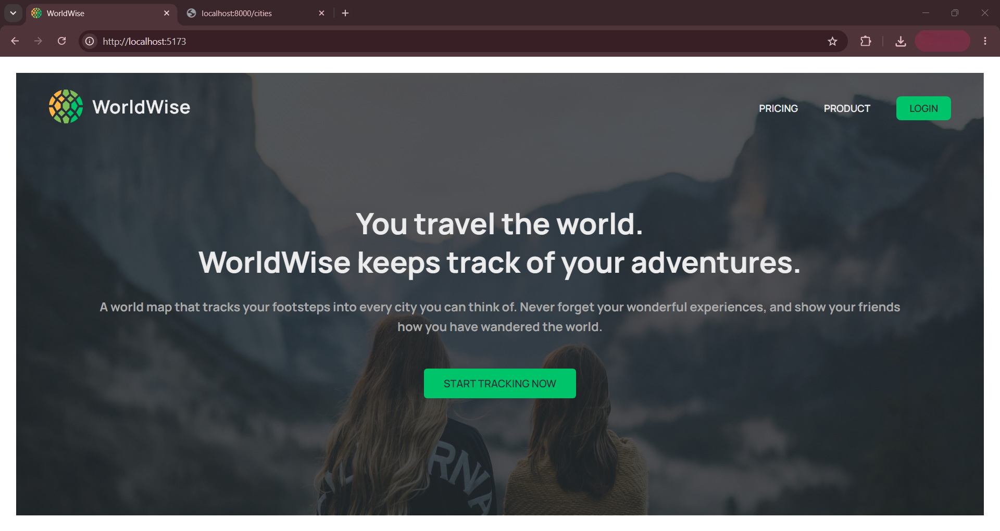
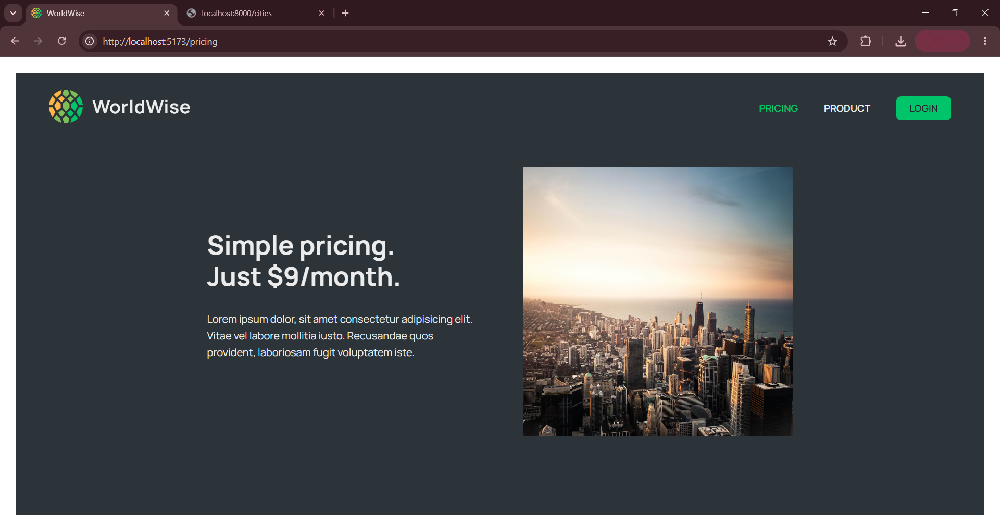
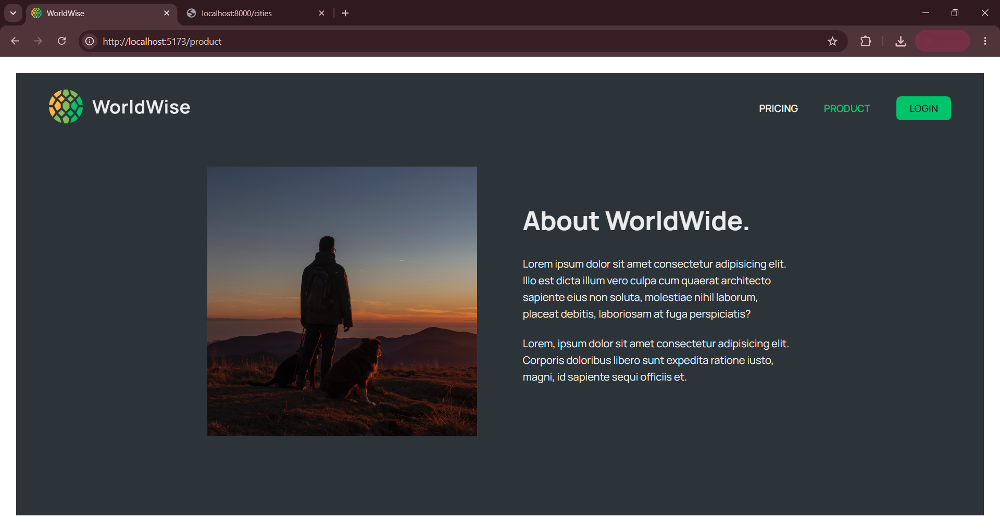
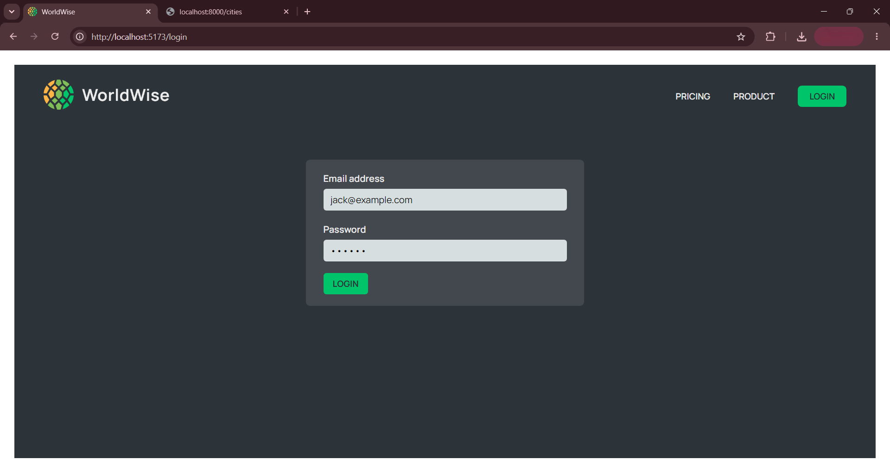
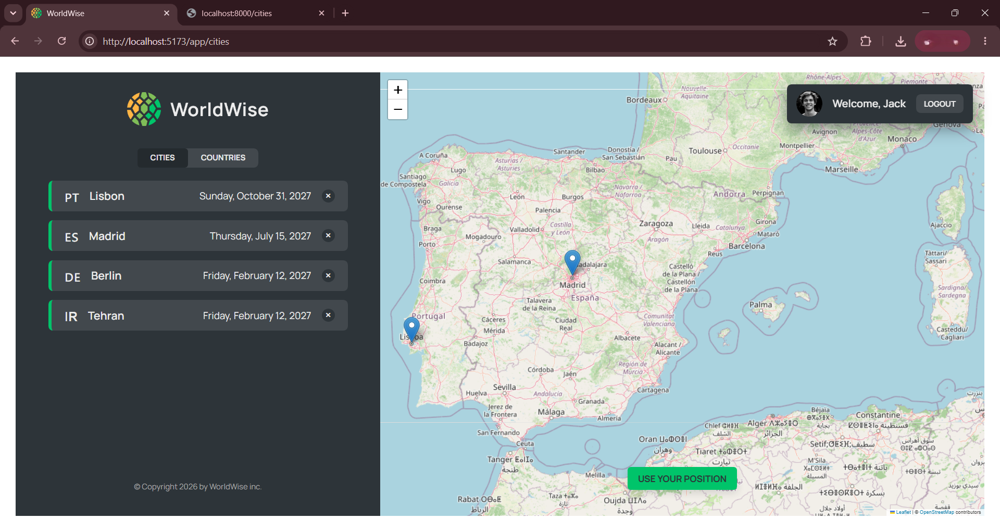
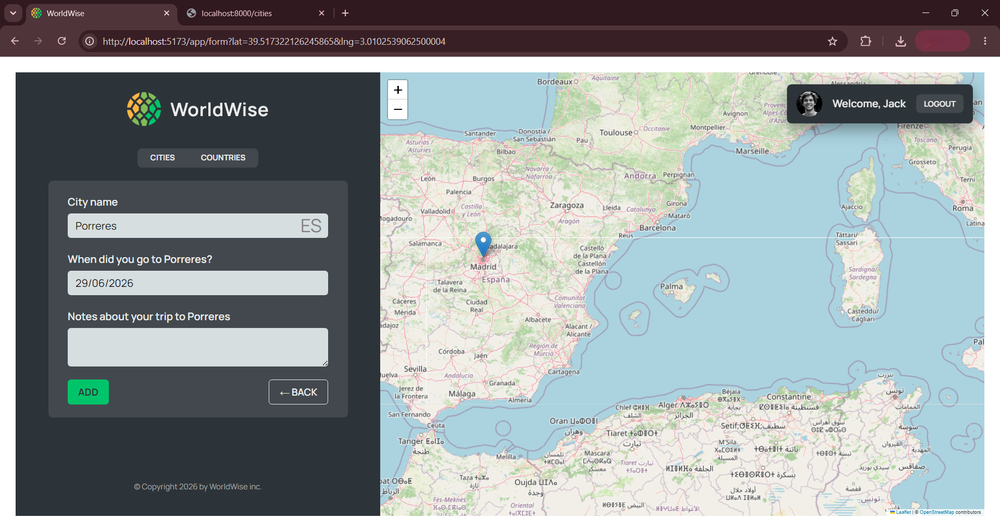

# 🌍 WorldWise

A travel-tracking app where you can log the cities and countries you've visited on an interactive world map, complete with visit notes, dates, and live geolocation.








## ✨ Features

- 📍 **Interactive map** (React-Leaflet) — click anywhere to drop a new city marker
- 🌐 **Reverse geocoding** — automatically detects country/city name from map clicks
- 📡 **"Use my location"** button via the browser Geolocation API (`useGeolocation` hook)
- 📅 **Date picker** for logging when you visited each city (`react-datepicker`)
- 🔐 **Protected routes** — app pages require login (`ProtectedRoute`, `FakeAuthContext`)
- ⚡ **Client-side routing** with nested layouts (React Router v7)
- 🗂️ **Global state** managed with Context API + `useReducer` (`CitiesContext`)
- 🔍 Browse and filter cities by country, with full city detail pages

## 🛠️ Built With

- **React 19** + **Vite 7**
- **React Router v7** — nested routes, protected routes, dynamic params
- **React-Leaflet** + **Leaflet** — interactive map rendering
- **react-datepicker** — visit date selection
- **Context API + useReducer** — global app state (cities, auth)
- **json-server** — mock REST API for local development
- **ESLint** (with `eslint-plugin-react-hooks` + React Compiler plugin) — code quality

## 🚀 Getting Started

### Prerequisites

- Node.js (v18+)
- npm

### Installation

```bash
# Clone the repo
git clone https://github.com/Hossein187/worldwise.git
cd worldwise

# Install dependencies
npm install
```

### Running locally

You need **two terminals** running at once:

```bash
# Terminal 1 — mock API server (serves data/cities.json on port 8000)
npm run server

# Terminal 2 — Vite dev server
npm run dev
```

The app will be running at `http://localhost:5173` (Vite's default port).

### Other scripts

```bash
npm run build      # production build
npm run preview    # preview the production build locally
npm run lint        # check code with ESLint
npm run format      # auto-fix lint issues
```

## 📁 Project Structure

```
src/
├── components/    # Reusable UI (Map, Form, CityList, Sidebar, Spinner, etc.)
├── context/       # CitiesContext (cities state), FakeAuthContext (login state)
├── hooks/         # useGeolocation, useUrlPosition
├── pages/         # Homepage, Login, AppLayout, ProtectedRoute, Pricing, Product
├── App.jsx
└── index.jsx
```

## 🧠 What I Learned

- Managing global state with Context API + `useReducer` and avoiding prop-drilling across deeply nested map/list components
- Handling async data fetching safely with `AbortController` to cancel stale requests when switching between rapidly clicked cities
- Working with the browser Geolocation API and handling real-world edge cases (permission denial, timeouts, inconsistent browser support)
- Building protected client-side routes with a fake auth context to simulate a real login flow
- Synchronizing URL state (lat/lng query params) with map position using React Router

## 📄 License

This project is for educational/portfolio purposes.

## 🔗 Live Demo

[View Live Demo](#) <!-- add your Vercel link here once deployed -->
